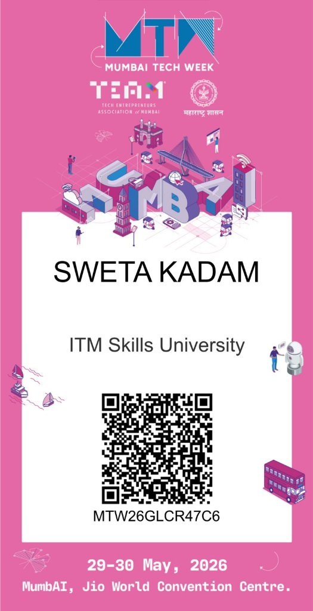
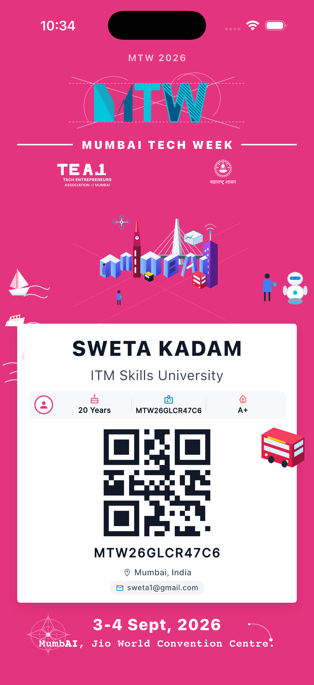

# Mumbai Tech Week 2026 – Digital Identity Card

[](https://flutter.dev)
[-EA337E)](https://apple.com)
[](#)

A pixel-accurate Flutter application recreating the official **Mumbai Tech Week 2026** identity card poster specifically tailored for the **iPhone 17 simulator in portrait mode**.

---

## Screenshots

| Reference Design | iPhone 17 Simulator Render |
| :---: | :---: |
|  |  |


---

## Project Overview

- **Course / Assignment:** Assignment No. 3
- **Target Device:** iPhone 17
- **Orientation:** Portrait Mode
- **Event:** Mumbai Tech Week 2026
- **Dates:** 3-4 Sept, 2026
- **Venue:** MumbAI, Jio World Convention Centre.

---


---

## Mandatory Flutter Widgets Checklist

All 10 required Flutter widgets are genuinely and actively integrated into the UI architecture:

- [x] **`Scaffold`** – Root app layout with custom MTW pink background.
- [x] **`AppBar`** – Minimal, non-intrusive pink AppBar with centered title `"MTW 2026"`.
- [x] **`Container`** – White identity card, stat pills, and email badge containers.
- [x] **`Column`** – Primary vertical layout (Header $\rightarrow$ Mumbai Skyline $\rightarrow$ White Card $\rightarrow$ Footer).
- [x] **`Row`** – Horizontal alignment for partner logos (`TEA.M` + `Maharashtra Govt`), attendee stats, location, and email.
- [x] **`CircleAvatar`** – Attendee profile avatar and badge.
- [x] **`Text`** – Name, university, ID, dates, and venue with custom weights and letter spacing.
- [x] **`Icon`** – Mandatory icons:
  - `Icons.cake_outlined` (Age)
  - `Icons.badge_outlined` (ID)
  - `Icons.bloodtype_outlined` (Blood Group)
  - `Icons.location_on_outlined` (Location)
  - `Icons.email_outlined` (Email)
- [x] **`SizedBox`** – Precise vertical and horizontal spacing.
- [x] **`Center`** – Screen alignment within `SafeArea` and QR centering.

---

## Folder Structure

```
lib/
├── main.dart                      # App entry point with portrait lock & theme
├── screens/
│   └── identity_card_screen.dart  # Main screen layout with layered graphics
├── widgets/
│   ├── mtw_header.dart            # MTW Monogram, title, & partner logos
│   ├── identity_details.dart      # Attendee info, stats, location & email
│   ├── qr_section.dart            # Dynamic high-contrast QR code
│   └── mtw_footer.dart            # Event dates, venue & blueprint art
└── theme/
    └── app_theme.dart             # Color constants & typography themes

assets/
└── svg/
    ├── mtw_logo.svg               # Architectural blueprint monogram
    ├── tea_logo.svg               # TEA.M logo
    ├── maharashtra_logo.svg       # Maharashtra Government circular emblem
    ├── mumbai_city.svg            # Isometric 3D Mumbai skyline illustration
    ├── decorative_left.svg        # Sailboats & Arabian Sea waves
    ├── decorative_right.svg       # AI Robot, developer, & BEST double-decker bus
    └── decorative_bottom.svg      # Blueprint radial rosette & orbit arcs
```

---

## Getting Started

### Prerequisites
- Flutter SDK `^3.44.8` or newer
- Xcode with iOS 18+ / iOS 26+ Simulator (iPhone 17)
- CocoaPods

### Installation & Run

1. **Clone the repository:**
   ```bash
   git clone https://github.com/your-username/mtw-identity-card-flutter.git
   cd mtw-identity-card-flutter
   ```

2. **Install dependencies:**
   ```bash
   flutter pub get
   ```

3. **Run on iPhone 17 Simulator:**
   ```bash
   flutter run -d "iPhone 17"
   ```

4. **Run Unit & Widget Tests:**
   ```bash
   flutter test
   ```

---
